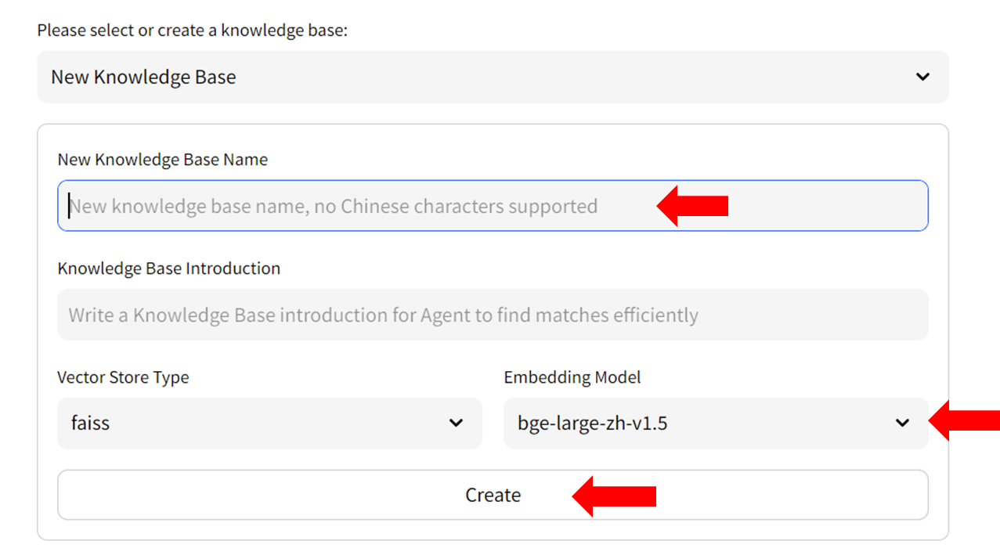
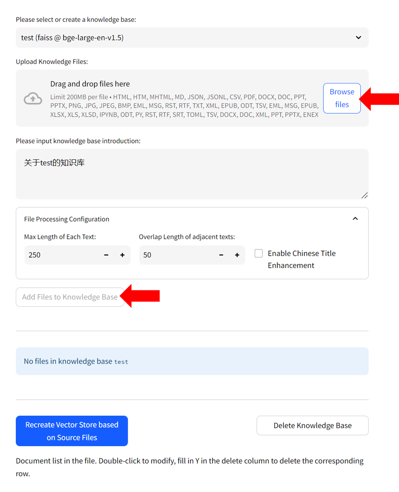

# Langchain-Chatchat with IPEX-LLM Acceleration on Intel GPUs

*Langchain-Chatchat* is a **RAG** (Retrieval Augmented Generation) application that implements knowledge and search engine based QA. This repo is a fork of [chatchat-space/Langchain-Chatchat](https://github.com/chatchat-space/Langchain-Chatchat), and includes [IPEX-LLM](https://github.com/intel-analytics/ipex-llm) optimizations to run it on **Intel GPU** (e.g., local PC with iGPU, discrete GPU such as Arc, Flex and Max). If you have any issues or suggestions, please submit them to the [IPEX-LLM Project](https://github.com/intel-analytics/ipex-llm/issues).
>You can change the UI language in the left-side menu. We currently support **English** and **简体中文** (see video demos below). 

<br/>

<table width="100%">
  <tr>
    <td align="center" width="50%"><b>English</b></td>
    <td align="center" width="50%"><b>简体中文</b></td>
  </tr>
  <tr>
    <td>
      <video src="https://github.com/intel-analytics/Langchain-Chatchat/assets/1995599/92bc5697-f633-4b26-b47f-1914228c659a" alt="english-video">english</video>
    </td>
    <td>
      <video src="https://github.com/intel-analytics/Langchain-Chatchat/assets/1995599/709bdc4d-dff9-45fa-bd55-90879ff8a5a8" alt="chinese-video">chinese</video>
    </td>
  </tr>
</table>

<br/>

The following sections introduce how to install and run Langchain-chatchat on **Intel Core Ultra platform (MTL)**, utilizing the iGPU to run both LLMs and embedding models. 

## Table of Contents
1. [RAG Architecture](langchain-chatchat-architecture)
2. [Installation](#installation)
3. [One-time Warmup](#one-time-warm-up)
4. [Start the Service](#start-the-service)
5. [How to Use](#usage)
6. [Trouble Shooting & Tips](#trouble-shooting--tips)

## Langchain-Chatchat Architecture

See the RAG pipeline in the Langchain-Chatchat architecture below ([source](https://github.com/chatchat-space/Langchain-Chatchat/blob/master/img/langchain%2Bchatglm.png)).


  
## Installation

### Download Langchain-Chatchat

Download the Langchain-Chatchat with IPEX-LLM integrations from [this link](https://github.com/intel-analytics/Langchain-Chatchat/archive/refs/heads/ipex-llm.zip). Unzip the content into a directory, e.g.,`C:\Users\arda\Downloads\Langchain-Chatchat-ipex-llm`. 

### Install Prerequisites

Visit the [Install IPEX-LLM on Windows with Intel GPU Guide](https://ipex-llm.readthedocs.io/en/latest/doc/LLM/Quickstart/install_windows_gpu.html), and follow [**Install Prerequisites**](https://ipex-llm.readthedocs.io/en/latest/doc/LLM/Quickstart/install_windows_gpu.html#install-prerequisites) to install Visual Studio, GPU driver, oneAPI, and Conda.  

### Install Python Dependencies

#### 1. Create a Conda Environment
Open **Anaconda Prompt (miniconda3)**, and run the following commands to create a new python environment:
  ```cmd
  conda create -n ipex-llm-langchain-chatchat python=3.11 libuv 
  conda activate ipex-llm-langchain-chatchat
  ```

  > [!NOTE]
  > When creating the conda environment we used python 3.11, which is different from the default recommended python version 3.9 in [Install IPEX-LLM on Windows with Intel GPU](https://ipex-llm.readthedocs.io/en/latest/doc/LLM/Quickstart/install_windows_gpu.html)


#### 2.  Install `ipex-llm` 
  ```cmd
  pip install --pre --upgrade ipex-llm[xpu] -f https://developer.intel.com/ipex-whl-stable-xpu
  pip install --pre --upgrade torchaudio==2.1.0a0  -f https://developer.intel.com/ipex-whl-stable-xpu
  ```
#### 3. Install Langchain-Chatchat Dependencies 
Switch to the root directory of Langchain-Chatchat you've downloaded (refer to the [download section](#download-langchain-chatchat)), and install the dependencies with the commands below. **Note: In the example commands we assume the root directory is `C:\Users\arda\Downloads\Langchain-Chatchat-ipex-llm`. Remember to change it to your own path**).
  ```cmd
  cd C:\Users\arda\Downloads\Langchain-Chatchat-ipex-llm
  pip install -r requirements_ipex_llm.txt 
  pip install -r requirements_api_ipex_llm.txt
  pip install -r requirements_webui.txt
  ```

### Configuration
-  In root directory of Langchain-Chatchat, run the following command to create a config:
    ```bash
    python copy_config_example.py
    ```
- Edit the file `configs\model_config.py`, change `MODEL_ROOT_PATH` to the absolute path where you put the downloaded models (LLMs, embedding models, ranking models, etc.)

### Download Models
Download the models and place them in the path `MODEL_ROOT_PATH` (refer to details in [Configuration](#configuration) section). 

Currently, we support only the LLM/embedding models specified in the table below. You can download these models using the link provided in the table. **Note: Ensure the model folder name matches the last segment of the model ID following "/", for example, for `THUDM/chatglm3-6b`, the model folder name should be `chatglm3-6b`.**


| Model |Category| download link | 
|:--|:--|:--|
|`THUDM/chatglm3-6b`|Chinese LLM| [HF](https://huggingface.co/THUDM/chatglm3-6b) or [ModelScope](https://www.modelscope.cn/models/ZhipuAI/chatglm3-6b/summary) |
|`meta-llama/Llama-2-7b-chat-hf`|English LLM| [HF](https://huggingface.co/meta-llama/Llama-2-7b-chat-hf) | 
|`BAAI/bge-large-zh-v1.5`|Chinese Embedding| [HF](https://huggingface.co/BAAI/bge-large-zh-v1.5) |
|`BAAI/bge-large-en-v1.5`| English Embedding|[HF](https://huggingface.co/BAAI/bge-large-en-v1.5) |

## One-time Warm-up
When you run this applcation on Intel GPU for the first time, it is highly recommended to do a one-time warmup (for GPU kernels compilation). 

In **Anaconda Prompt (miniconda3)**, under the root directory of Langchain-Chatchat, with conda environment activated, run the following commands:

```cmd
conda activate ipex-llm-langchain-chatchat
call "C:\Program Files (x86)\Intel\oneAPI\setvars.bat"
set SYCL_CACHE_PERSISTENT=1
set BIGDL_LLM_XMX_DISABLED=1
python warmup.py
```

> [!NOTE]
> The warmup may take several minutes. You just have to run it one-time on after installation. 

## Start the Service
Open **Anaconda Prompt (miniconda3)** and run the following commands:
```cmd
conda activate ipex-llm-langchain-chatchat
call "C:\Program Files (x86)\Intel\oneAPI\setvars.bat"
set SYCL_CACHE_PERSISTENT=1
set BIGDL_LLM_XMX_DISABLED=1
set no_proxy=localhost,127.0.0.1
python startup.py -a
```

> [!NOTE]
> Please skip the `call "C:\Program Files (x86)\Intel\oneAPI\setvars.bat"` step if you have done that during [one-time warmup](#one-time-warm-up).

You can find the Web UI's URL printted on the terminal logs, e.g. http://localhost:8501/.

Open a browser and navigate to the URL to use the Web UI. 

## Usage

To start chatting with LLMs, simply type your messages in the textbox at the bottom of the UI. 

### How to use RAG

#### Step 1: Create Knowledge Base

- Select `Manage Knowledge Base` from the menu on the left, then choose `New Knowledge Base` from the dropdown menu on the right side.
  <p align="center"></p>
- Fill in the name of your new knowledge base (example: "test") and press the `Create` button. Adjust any other settings as needed. 
  <p align="center"></p>
- Upload knowledge files from your computer and allow some time for the upload to complete. Once finished, click on `Add files to Knowledge Base` button to build the vector store. Note: this process may take several minutes.
  <p align="center"></p>


#### Step 2: Chat with RAG

You can now click `Dialogue` on the left-side menu to return to the chat UI. Then in `Knowledge base settings` menu, choose the Knowledge Base you just created, e.g, "test". Now you can start chatting. 

<p align="center"></p>

<br/>

For more information about how to use Langchain-Chatchat, refer to Official Quickstart guide in [English](./README_en.md), [Chinese](./README_chs.md), or the [Wiki](https://github.com/chatchat-space/Langchain-Chatchat/wiki/).


### Trouble Shooting & Tips

#### 1. Version Compatibility

Ensure that you have installed versions of `ipex-llm` and `bigdl-core-xe-21` that are greater than or equal to **2.1.0b20240321**. To upgrade, follow the [installation instructions](#2--install-ipex-llm) above.

#### 2. Prompt Templates

In the left-side menu, you have the option to choose a prompt template. There're several pre-defined templates - those ending with '_cn' are Chinese templates, and those ending with '_en' are English templates. You can also define your own prompt templates in `configs/prompt_config.py`. Remember to restart the service to enable these changes. 


