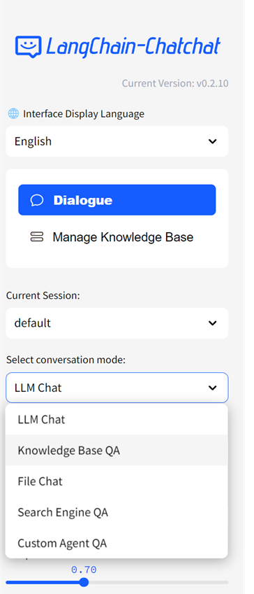
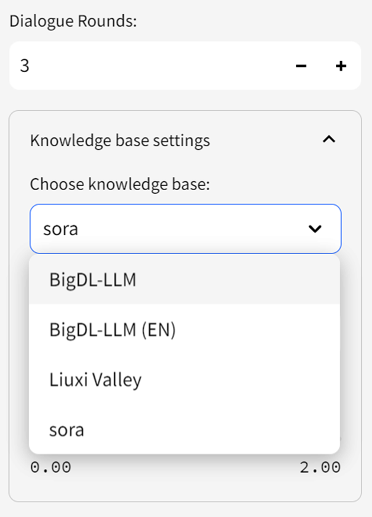

# Langchain-Chatchat with BigDL-LLM Acceleration on Intel GPUs


This is a RAG (Retrieval Augmented Generation) application that aims to implement knowledge and search engine based QA using LLMs optimized by **BigDL-LLM**. 

This repo is a fork of [chatchat-space/Langchain-Chatchat](https://github.com/chatchat-space/Langchain-Chatchat) which includes BigDL-LLM optimizations to run it on **Intel GPUs**. You can change the UI language in the left-side menu. Now we support **English** and **简体中文** (see screenshot below). 

<div style="display:inline-block">
  
</div>

<br/>
The following sections introduces how to install and run Langchain-chatchat on **Intel Core Ultra platform (MTL)**, utilizing the iGPU to run both LLMs and embedding models. 

## Installation

### Install Prerequisites

Visit the [Install BigDL-LLM on Windows with Intel GPU](https://bigdl.readthedocs.io/en/latest/doc/LLM/Quickstart/install_windows_gpu.html) and follow [**Install Prerequisites**](https://bigdl.readthedocs.io/en/latest/doc/LLM/Quickstart/install_windows_gpu.html#install-prerequisites) to install Visual Studio, GPU driver, oneAPI, and Conda.  

### Install Python Dependencies

1.  Open **Anaconda Prompt (miniconda3)**, run following command to create a new python environment:
    ```cmd
    conda create -n bigdl-langchain-chatchat python=3.11 libuv 
    conda activate bigdl-langchain-chatchat
    ```
    > **Note**: When creating the conda environment we used python 3.11, which is different from the default recommended python version 3.9 in [Install BigDL-LLM on Windows with Intel GPU](https://bigdl.readthedocs.io/en/latest/doc/LLM/Quickstart/install_windows_gpu.html)
    > 
2.  install `bigdl-llm` 
    ```cmd
    pip install --pre --upgrade bigdl-llm[xpu] -f https://developer.intel.com/ipex-whl-stable-xpu
    pip install --pre --upgrade torchaudio==2.1.0a0  -f https://developer.intel.com/ipex-whl-stable-xpu
    ```
3. Install dependencies of Langchain-Chatchat
    ```cmd
    git clone https://github.com/intel-analytics/Langchain-Chatchat.git
    cd Langchain-Chatchat

    pip install -r requirements_bigdl.txt 
    pip install -r requirements_api_bigdl.txt
    pip install -r requirements_webui.txt
    ```

### Configuration
-  Run the following command to create a config:
    ```bash
    python copy_config_example.py
    ```
- Edit the file `configs\model_config.py`, change `MODEL_ROOT_PATH` to the absolute path where you put the downloaded models (LLMs, embedding models, ranking models, etc.)

### Download Models
Download the models to the path you specified in `MODEL_ROOT_PATH` (refer to [Configuration](#configuration) section). 

Currently, only `THUDM/chatglm3-6b` (a Chinese LLM) and `meta-llama/Llama-2-7b-chat-hf` (an English LLM), as well as `BAAI/bge-large-zh-v1.5` and `BAAI/bge-large-en-v1.5` (embedding models) are supported. Please download the 4 models to `MODEL_ROOT_PATH` and **rename the model folder names as required in the below table.**


| Model | download link | model folder RENAME to |
|:--|:--|:--|
|`THUDM/chatglm3-6b`| [HF](https://huggingface.co/THUDM/chatglm3-6b) or [ModelScope](https://www.modelscope.cn/models/ZhipuAI/chatglm3-6b/summary) | chatglm3-6b |
|`meta-llama/Llama-2-7b-chat-hf`| [HF](https://huggingface.co/meta-llama/Llama-2-7b-chat-hf) | bigdl-7b-chat-hf |
|`BAAI/bge-large-zh-v1.5`| [HF](https://huggingface.co/BAAI/bge-large-zh-v1.5) | bge-large-zh-v1.5 |
|`BAAI/bge-large-en-v1.5`| [HF](https://huggingface.co/BAAI/bge-large-en-v1.5) | bge-large-en-v1.5 |

## One-time Warm-up
When you run this applcation on Intel GPU for the first time, it is highly recommended to do a one-time warmup (for GPU kernels compilation). 

In **Anaconda Prompt (miniconda3)**, run the following commands:
```cmd
conda activate bigdl-langchain-chatchat
python warmup.py
```

> **Note**: The warmup may take several minutes. You just have to run it one-time on after installation. 

## Start the Service
 Open **Anaconda Prompt (miniconda3)** and run the following commands:
```cmd
conda activate bigdl-langchain-chatchat
call "C:\Program Files (x86)\Intel\oneAPI\setvars.bat"
set SYCL_CACHE_PERSISTENT=1
set BIGDL_LLM_XMX_DISABLED=1
set no_proxy=localhost,127.0.0.1
python startup.py -a
```
You can find the Web UI's URL printted on the terminal logs, e.g. http://localhost:8501/.

Open a browser and navigate to the URL to use the Web UI. 

## Usage

To start chatting with LLMs, simply type your messages in the textbox at the bottom of the UI. By default, the conversation mode is `LLM Chat`, which does not involve any external knowledge. 

### How to use RAG

#### Step 1: Create Knowledge Base

- Choose `Manage Knowledge Base` in the left menu, choose `New Knowledge Base` 
 in the dropdown menu. 
    
- Fill in the information of the knowledge base, choose embedding model, and click `Create`. 
    
- Upload knowledge files from your computer, wait some time for the upload to finish, and click `Add files to Knowledge Base` to create the vector store. Note: This may take a few minutes to finish. 
    

#### Step 2: Chat with RAG

You can now click `Dialogue` to return to the chat UI， and select `Knowledge Base QA` in `Conversation Mode`. Then in `Knowledge base settings` menu, choose the Knowledge Base you just created. Now you can start chatting. 

<div style="display:inline-block">
  
</div>


For more information about how to use Langchain-Chatchat, refer to Official Quickstart guide in [English README](./README_en.md), or [中文文档](./README_chs.md), as well as the [Full Wiki](https://github.com/chatchat-space/Langchain-Chatchat/wiki/). 


 


