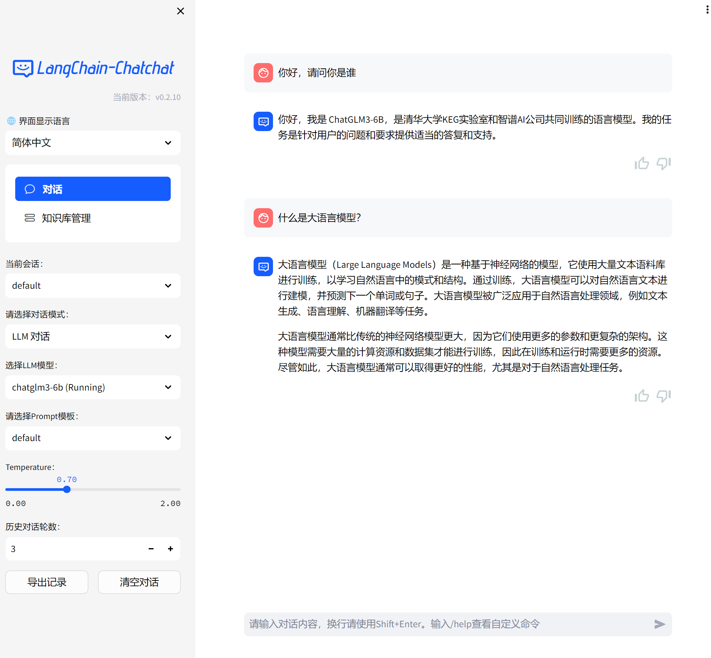

# Langchain-chatchat with BigDL-LLM Acceleration on Intel GPUs


A RAG (Retrieval Augmented Generation) application aims to implement knowledge and search engine based QA using LLMs with **BigDL-LLM** accelerations. 

This repo is a fork of [chatchat-space/Langchain-Chatchat](https://github.com/chatchat-space/Langchain-Chatchat) which includes BigDL-LLM optimizations to run it on **Intel GPUs**.

The following sections introduces how to install and run Langchain-chatchat on Intel Core Ultra platform, utilizing the iGPU to run both LLMs and embedding models. 





## Installation

### Install Prerequisites

Visit the [Install BigDL-LLM on Windows with Intel GPU](https://bigdl.readthedocs.io/en/latest/doc/LLM/Quickstart/install_windows_gpu.html) and follow [**Install Prerequisites**](https://bigdl.readthedocs.io/en/latest/doc/LLM/Quickstart/install_windows_gpu.html#install-prerequisites) to install Visual Studio, GPU driver, oneAPI, and Conda.  

### Install Python Dependencies

1.  Open **Anaconda Prompt (miniconda3)**, run following command to create a new python environment:
    ```cmd
    conda create -n bigdl-langchain-chatchat python=3.11 libuv 
    conda activate bigdl-langchain-chatchat
    ```
    > **Note**: When creating the conda environment we used python 3.11, which is different from the default recommended python version 3.9 in [Install BigDL-LLM on Windows with Intel GPU](https://bigdl.readthedocs.io/en/latest/doc/LLM/Quickstart/install_windows_gpu.html)
    > 
2.  install `bigdl-llm` 
    ```cmd
    pip install --pre --upgrade bigdl-llm[xpu] -f https://developer.intel.com/ipex-whl-stable-xpu
    pip install --pre --upgrade torchaudio==2.1.0a0  -f https://developer.intel.com/ipex-whl-stable-xpu
    ```
3. Install dependencies of Langchain-Chatchat
    ```cmd
    git clone https://github.com/intel-analytics/Langchain-Chatchat.git
    cd Langchain-Chatchat

    pip install -r requirements_bigdl.txt 
    pip install -r requirements_api_bigdl.txt
    pip install -r requirements_webui.txt
    ```

### Configuration
-  Run the following command to create a config:
    ```bash
    python copy_config_example.py
    ```
- Edit the file `configs\model_config.py`, change `MODEL_ROOT_PATH` to the absolute path where you put the downloaded models (LLMs, embedding models, ranking models, etc.)

### Download Models
Download the models to the path you specified in `MODEL_ROOT_PATH` (refer to [Configuration](#configuration) section). 

Currently, only `THUDM/chatglm3-6b` (a Chinese LLM) and `meta-llama/Llama-2-7b-chat-hf` (an English LLM), and `BAAI/bge-large-zh-v1.5` (an embedding model) are supported. Please download the 3 models to `MODEL_ROOT_PATH` and **rename the model folder names as required in the below table.**


| Model | download link | model folder RENAME to |
|:--|:--|:--|
|`THUDM/chatglm3-6b`| [HF](https://huggingface.co/THUDM/chatglm3-6b) or [ModelScope](https://www.modelscope.cn/models/ZhipuAI/chatglm3-6b/summary) | chatglm3-6b |
|`meta-llama/Llama-2-7b-chat-hf`| [HF](https://huggingface.co/meta-llama/Llama-2-7b-chat-hf) | bigdl-7b-chat-hf |
|`BAAI/bge-large-zh-v1.5`| [HF](https://huggingface.co/BAAI/bge-large-zh-v1.5) | bge-large-zh-v1.5 |

## One-time Warm-up
When you run this applcation on Intel GPU for the first time, it is highly recommended to do a one-time warmup (for GPU kernels compilation). 

In **Anaconda Prompt (miniconda3)**, run the following commands:
```cmd
conda activate bigdl-langchain-chatchat
python warmup.py
```

> **Note**: The warmup may take several minutes. You just have to run it one-time on after installation. Later if you want to use it, you can just start the service and open 

## Start the Service
 Open **Anaconda Prompt (miniconda3)** and run the following commands:
```cmd
conda activate bigdl-langchain-chatchat
call "C:\Program Files (x86)\Intel\oneAPI\setvars.bat"
set SYCL_CACHE_PERSISTENT=1
set BIGDL_LLM_XMX_DISABLED=1
set no_proxy=localhost,127.0.0.1
python startup.py -a
```
You can find the Web UI's URL printted on the terminal logs, e.g. http://localhost:8501/.

Open a browser and navigate to the URL to use the Web UI. 

## Usage

To begin, simply type your messages in the textbox at the bottom of the UI and leave all menu options to defaults. 

Once you're familar with the basics, you can continue to customize your experience through options in the left-side menu. For example,  

- Change the UI language in `界面显示语言`. Now we support English and Simplified Chinese. 
- Choose `对话模式`: `LLM对话` for chatting without RAG; `知识库问答`/`文件问答`for chatting with RAG. 
- Choose LLM: chatglm, llama2, etc.
- Choose prompt templates
- Specify Rounds of Conversation history to keep. 


For more information about how to use Langchain-Chatchat, refer to Official Quickstart guide in [English README](./README_en.md), or [中文文档](./README_chs.md), as well as the [Full Wiki](https://github.com/chatchat-space/Langchain-Chatchat/wiki/). 


 


